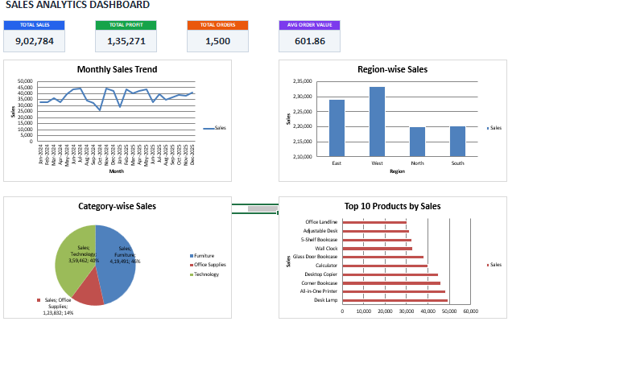

# Sales Analytics Dashboard
## Dashboard Preview

## Project Overview
This project is an Excel-based Sales Analytics Dashboard created to analyze sales performance using Pivot Tables, KPI Cards, and Charts.

## Dashboard Preview

## Features

- KPI Summary Cards
- Monthly Sales Trend Analysis
- Region-wise Sales Analysis
- Category-wise Sales Analysis
- Top Products Analysis

## Tools Used

- Microsoft Excel
- Pivot Tables
- Pivot Charts
- Slicers
- Conditional Formatting

## Files Included

- Sales_Dashboard.xlsx – Complete Excel Dashboard
- Sales_Analytics_Dashboard.png – Dashboard Screenshot
- README.md – Project Documentation

## Project Link

GitHub Repository:
https://github.com/akshitha142006-cpu/Sales-Analytics-Dashboard

## Author
Akshitha
